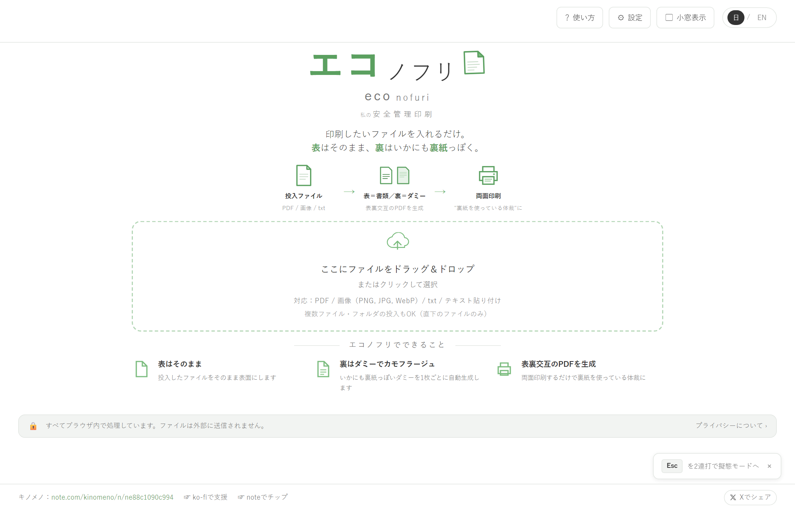
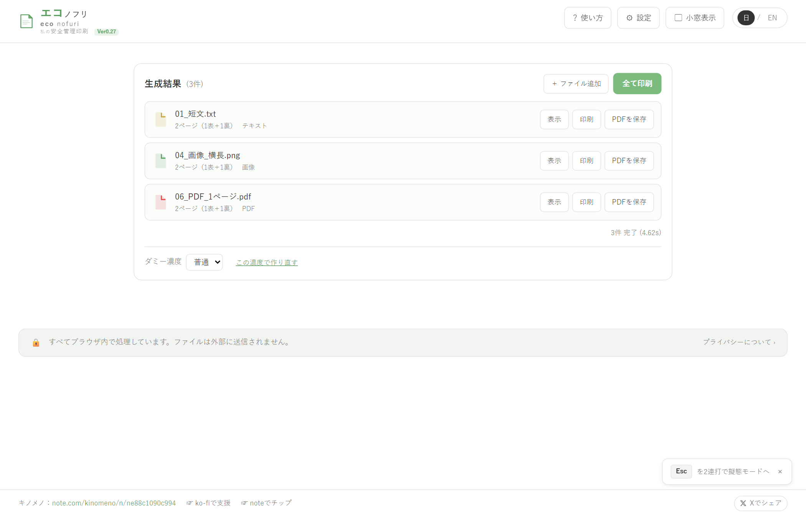
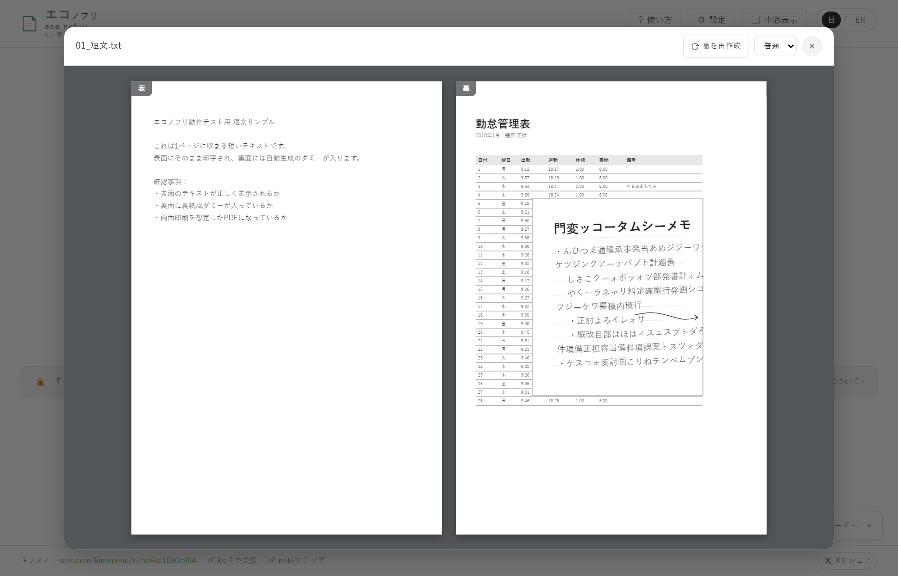
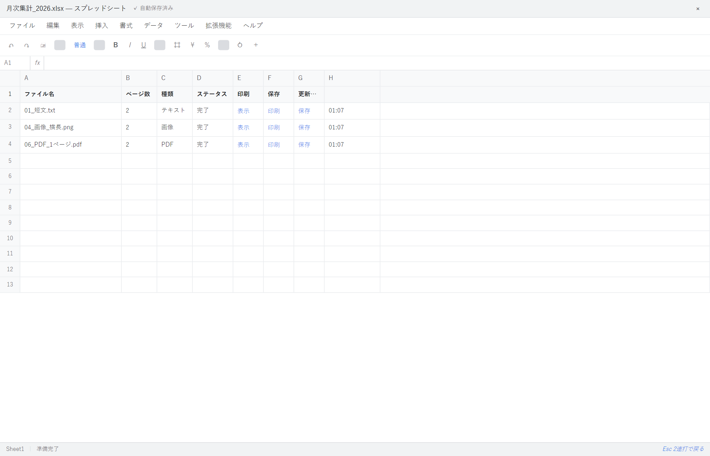
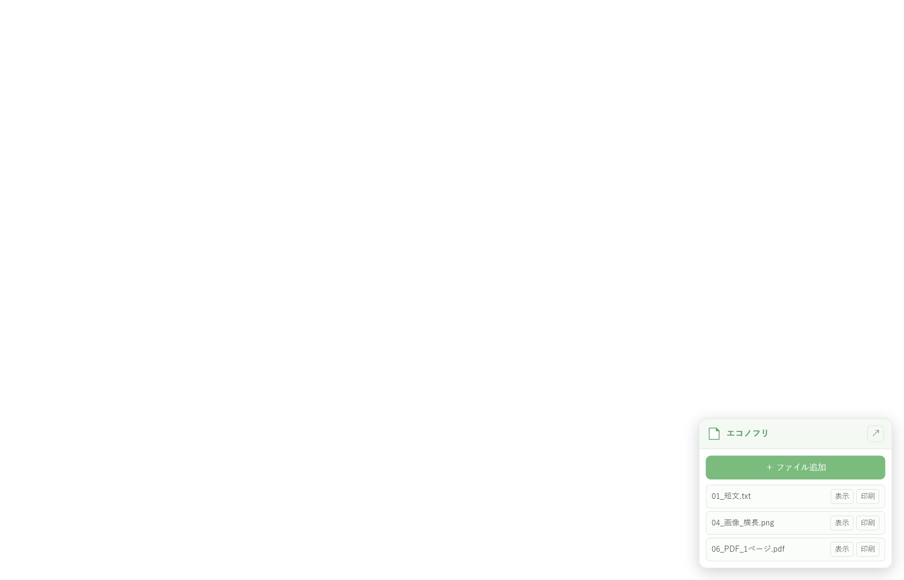

# 「裏紙を使え」と言われたので、新品の紙の裏に裏紙風の何かを一緒に刷るアプリを作りました

こんにちは、キノメノです。

オフィスで「**裏紙を使え**」と言われる場面があります。コピー機の手差しトレイにわざわざ紙をセットしに行かなきゃいけなくて、正直、面倒くさい。デスクから印刷ボタンを押して新品の紙に刷ると、上の人に注意されるあのやつです。

そこで考えました。

**本物の裏紙を用意するのが面倒なら、新品の紙の裏側に「いかにも裏紙っぽい何か」を一緒に印刷してしまえばいいのでは？**

…という、ちょっと馬鹿馬鹿しくて実用的なツールを作りました。

---

## エコノフリ（eco nofuri）

製品名：**エコノフリ**（英字：**eco nofuri**）
サブタイトル：**私の安全管理印刷**（本音は身を守るための印刷）

公開URL：（後でVercel／GitHubのURLに差し替え）

ブラウザで開いて、印刷したいファイルを投げ込むだけ。**表＝あなたの書類／裏＝裏紙っぽいダミー** の表裏交互PDFが出てきます。両面印刷すれば、新品の紙の裏に「ボツ書類の片面」が刷られているように見える、というわけです。

## 使い方

### ① ファイルを投げ込む

対応形式：

- **PDF**
- **画像**（PNG / JPG / WebP）
- **txt**（テキストファイル）
- **テキスト貼り付け**（メール本文をコピペで投入できる）

複数ファイルやフォルダごと放り込んでもOKです。

### ② 「表示」で確認

「表示」ボタンで**表と裏が同時に並んで見える**プレビュー画面が出ます。

- 「裏を再作成」ボタンで、表は変えずに裏だけ作り直し
- 濃度を変えながら何度でも試せる
- ←→キーでページ送り

### ③ 印刷／保存

そのまま **両面印刷** すれば、見た目だけは完璧な「裏紙を使っている書類」の出来上がりです。「PDFを保存」でダウンロードもできます。

---

## 裏ダミーの濃度

| 段階 | 中身 |
|---|---|
| 薄い | はっきり読めるけど少し色あせた書類 |
| 普通 | ボツ書類らしい書類 |
| 濃い | 図表もスタンプも盛り盛り |
| **狂気** | **印刷大失敗演出**（斜め印刷／折り目／FAX劣化／給紙ミス／前の原稿に重ねコピー／破れたメモ／黒ペンで金額消し… 全部入り） |

「狂気」モードは、実用ではなく**ネタ用**です。「あー、こんな書類見たことある！」をたくさん詰め込みました。

裏のパターンは **28種類**（社内通達／FAX送信票／日報／週報／月報／勤怠表／見積書／請求書／組織図／フロー図／契約書／チェックリスト／手書きメモ／図面／誤字POP …等）。各パターンは中の擬似日本語や部署名・人名・日付が毎回ランダムに変わるので、**実質同じものは二度と出ません**。

---

## ちょっとした隠し機能

### 上司対策：カモフラージュ画面モード

**Escキーを2連打**すると、画面がスプレッドシート風UIに化けます。「月次集計_2026.xlsx」というそれっぽいタイトル付き。上司が後ろから近づいてきても安心です（多分）。

### 小窓モード

ヘッダーの「小窓表示」を押すと、画面の右下に小さく縮みます。常駐させておけて、邪魔になりません。

---

## このアプリの特徴

### すべてブラウザ内で処理。**ファイルは外部に送信されません。**

これ、地味だけど大事なところです。投げ込んだPDFや書類が外部サーバーに送られたら、それは仕事で使えないツールです。エコノフリは pdf-lib と pdf.js をブラウザ内で動かすだけで、サーバーは一切介在しません。

### 無料

サーバー費が要らないので、無料で公開できます。

### 多言語（日本語／英語）

右上の `日 / EN` で切り替え。英語で「裏紙文化」が伝わるかは別として…。

---

## 技術的なこと（興味があれば）

- 素のHTML / CSS / JavaScript で書きました（ビルドなし）
- PDF組立：[pdf-lib](https://pdf-lib.js.org/)
- PDF読込：[pdf.js](https://mozilla.github.io/pdf.js/)
- 裏ダミー生成エンジンは独立モジュールにしたので、将来ブラウザ拡張版／デスクトップ常駐版（exe）も同じエンジンで作れます

---

## 公開URL

- 本体：（後でURL差し替え）
- ソースコード：（GitHubのURL）
- 紹介記事（このページ）：このnote記事

## 気に入ったら…

無料で公開しています。「面白かった」「役に立った」と思っていただけたら、開発の励みになります。

- ☞ [ko-fiで支援](https://ko-fi.com/kinomeno)
- ☞ [noteでチップ](https://note.com/kinomeno)
- Xでシェアしていただけると、本当に助かります

---

## おわりに

「裏紙を使え」と言われるあなたの**安全管理印刷**の一助になれば幸いです。

クスッと笑って、こっそり使ってください。

それでは。

キノメノ
